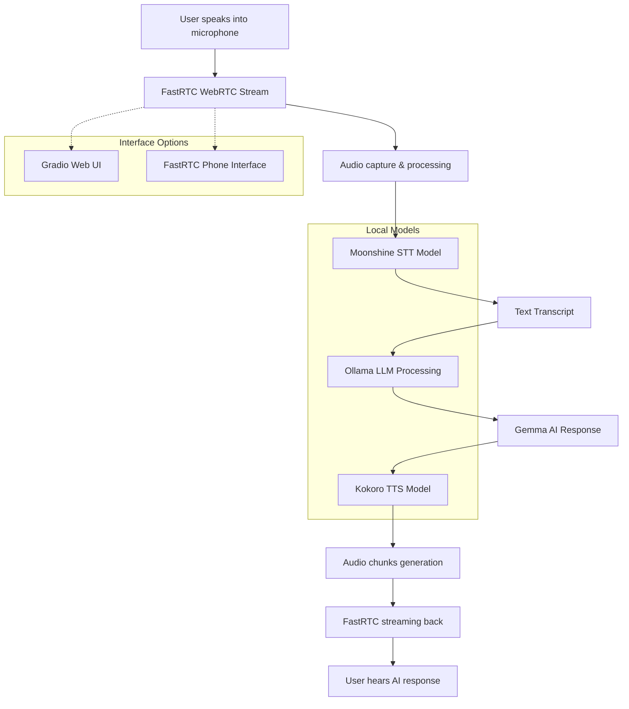

# Local Voice AI Agent - Workflow Documentation

## 🎯 Project Overview
This is a **real-time voice chatbot** that allows natural voice conversations with local AI models, providing privacy and low-latency responses by running everything locally.

## 📊 System Architecture Flow 



## 🔧 Component Breakdown

### **Core Models & Libraries:**
- **FastRTC**: WebRTC-based real-time communication framework
- **Moonshine**: Speech-to-Text (STT) conversion model
- **Kokoro**: Text-to-Speech (TTS) synthesis model  
- **Ollama**: Local LLM runtime for Gemma models
- **Gemma**: Google's open-source language model (1b/4b variants)

### **Two Implementation Versions:**

#### 1. **Basic Version** (`local_voice_chat.py`)
```python
# Simple echo function with minimal configuration
def echo(audio):
    transcript = stt_model.stt(audio)           # Convert speech to text
    response = chat(model="gemma3:1b", ...)     # Generate response
    for audio_chunk in tts_model.stream_tts_sync(response_text):
        yield audio_chunk                       # Stream audio back
```

#### 2. **Advanced Version** (`local_voice_chat_advanced.py`)
- Enhanced logging with Loguru
- System prompt for better AI behavior
- Command-line arguments support
- Phone interface option (`--phone` flag)
- Uses larger Gemma 4b model for improved responses

## 📋 Detailed Workflow Steps

### **Step 1: Audio Capture & Processing**
- User speaks into microphone
- FastRTC captures real-time audio stream
- Audio processed in chunks for low-latency

### **Step 2: Speech-to-Text Conversion**
- Moonshine STT model converts audio → text transcript
- Happens locally (no external API calls)
- Debug logging shows transcript in advanced version

### **Step 3: LLM Processing**
- Text sent to Ollama running Gemma model
- **Basic**: Simple user message
- **Advanced**: Includes system prompt for better responses:
  ```
  "You are a helpful LLM in a WebRTC call. Your goal is to demonstrate 
  your capabilities in a succinct way. Your output will be converted to 
  audio so don't include emojis or special characters in your answers."
  ```

### **Step 4: Text-to-Speech Synthesis** 
- AI response converted to audio using Kokoro TTS
- Audio generated as streaming chunks
- Synchronized streaming for real-time feel

### **Step 5: Audio Response Delivery**
- Audio chunks yielded back through FastRTC stream
- User hears AI response through speakers/headphones

## 🚀 Launch Options

### **Web Interface (Default)**
```bash
python local_voice_chat_advanced.py
```
- Gradio-based web UI
- Browser-based interaction

### **Phone Interface** 
```bash
python local_voice_chat_advanced.py --phone
```
- Provides temporary phone number
- Anyone can call to interact with AI
- Real phone-based voice conversation

## 🔄 Key Features

- **100% Local Processing**: No external API dependencies
- **Real-time Streaming**: Low-latency voice interaction  
- **Privacy-First**: All processing happens on your machine
- **Dual Interfaces**: Web UI + Phone number options
- **Scalable Models**: Can switch between Gemma 1b/4b based on hardware

## 🛠️ Technical Implementation Details

### **Dependencies (from pyproject.toml)**
```toml
dependencies = [
    "fastrtc[stt]>=0.0.19",    # WebRTC communication
    "kokoro-onnx>=0.4.7",      # Text-to-speech
    "loguru>=0.7.3",           # Enhanced logging
    "ollama>=0.4.7",           # Local LLM runtime
]
```

### **Model Configuration**
```python
stt_model = get_stt_model()  # moonshine/base
tts_model = get_tts_model()  # kokoro
```

### **Stream Setup**
```python
stream = Stream(ReplyOnPause(echo), modality="audio", mode="send-receive")
```

## 🔍 Data Flow Summary

1. **Input**: User voice → Microphone
2. **Capture**: FastRTC WebRTC stream
3. **STT**: Moonshine converts audio → text
4. **LLM**: Ollama + Gemma processes text → response
5. **TTS**: Kokoro converts response → audio chunks
6. **Output**: FastRTC streams audio → User speakers

This architecture ensures **private, fast, and natural voice conversations** with AI while maintaining complete control over your data and models.